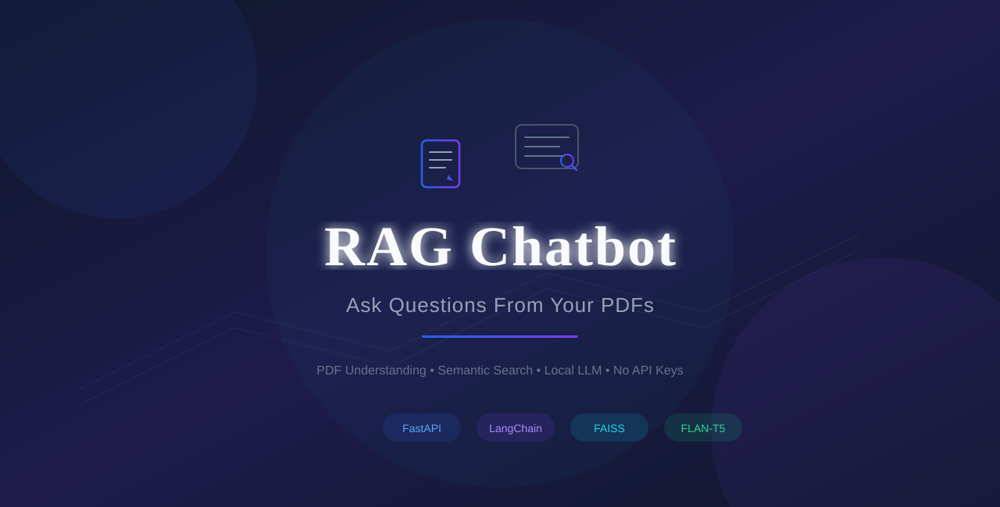
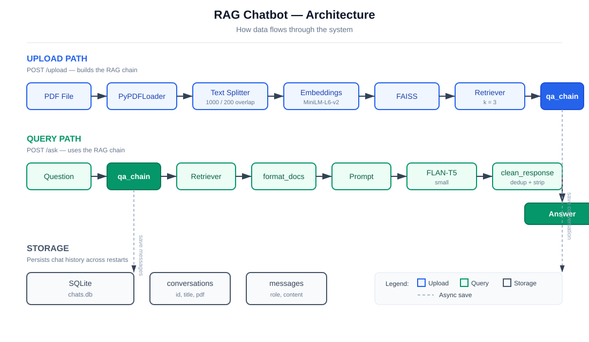

<div align="center">



# RAG Chatbot

**Ask Questions From Your PDFs**

[](https://opensource.org/licenses/MIT)
[](https://www.python.org/)
[](https://fastapi.tiangolo.com/)
[](https://huggingface.co/)
[](https://github.com/Mohak-talodhikar/RAG-ChatBot)

[API Docs](http://127.0.0.1:8000/docs) &bull; [Report Issue](https://github.com/Mohak-talodhikar/RAG-ChatBot/issues) &bull; [LinkedIn](https://www.linkedin.com/in/mohak-talodhikar/)

</div>

---

## The Problem

You have a 200-page report. You need **one answer**. Reading it all takes 3 hours. Asking ChatGPT means uploading your private file to the cloud — and hoping it doesn't make things up.

There has to be a better way.

## The Hero

**RAG Chatbot** reads your PDF **locally** and answers using **only what's inside it**. No API keys. No cloud. No made-up answers. If the answer isn't in your document, it says so — instead of guessing.

> **RAG** = Retrieval-Augmented Generation. In plain words: the AI first *finds* the right lines from your document, then *writes* the answer using only those lines.

---

## How the Magic Happens

Imagine you upload a company report and ask: *"What is our revenue?"*

**Step 1 — Read.** The PDF is extracted and split into small meaningful chunks (1000 characters each, with 200-character overlap so no context is lost at the boundaries).

**Step 2 — Understand.** Each chunk is converted into a list of numbers (an *embedding*) that captures its meaning — using `sentence-transformers/all-MiniLM-L6-v2`.

**Step 3 — Find.** Your question is converted the same way, then FAISS (a fast similarity search library) hunts down the **top 3 most relevant chunks** in milliseconds.

**Step 4 — Answer.** Those 3 chunks + your question are handed to `google/flan-t5-small`, a small instruction-tuned AI model, which writes a clean, focused answer — grounded in your document.



---

## What It Can Do

- **PDF upload** — drop in any PDF, it gets processed and indexed automatically
- **Grounded answers** — every answer comes from your document, not the AI's memory
- **Honest about gaps** — if the answer isn't in the PDF, it says so clearly
- **Chat history** — conversations are stored in SQLite and survive server restarts
- **Beautiful UI** — dark mode, typing indicators, suggested questions, keyboard shortcuts
- **Runs 100% offline** — free open-source models, no GPU, no internet needed after setup

---

## Try It in 2 Minutes

**1. Clone and install:**
```bash
git clone https://github.com/Mohak-talodhikar/RAG-ChatBot.git
cd RAG-ChatBot
pip install -r Backend/requirements.txt
```

**2. Start the backend:**
```bash
cd Backend
uvicorn app:app --reload
```

**3. Start the frontend (new terminal):**
```bash
cd Frontend
python -m http.server 3000
```

**4. Open** [`http://localhost:3000`](http://localhost:3000) — upload a PDF, ask a question.

---

## The Honest Limitations

- **One PDF at a time** — uploading a new PDF starts a new conversation (old chats stay saved)
- **CPU inference** — answers take a few seconds; a GPU would make it faster
- **512 token cap** — answers are short and focused by design
- **Small model** — FLAN-T5-small is fast and free, but occasionally mixes up specific facts; a bigger model fixes this

---

## The Tech Behind the Story

| Layer | Technology |
|---|---|
| Backend | Python, FastAPI, Uvicorn |
| AI Pipeline | LangChain (LCEL chains) |
| Vector Search | FAISS (faiss-cpu) |
| Embeddings | `sentence-transformers/all-MiniLM-L6-v2` |
| LLM | `google/flan-t5-small` (HuggingFace) |
| PDF Reading | PyPDF |
| Chat Storage | SQLite (`chats.db`) |
| Frontend | Vanilla HTML, CSS, JavaScript |

---

## The End (For Now)

Built with curiosity by **[Mohak Talodhikar](https://www.linkedin.com/in/mohak-talodhikar/)** — a fresher who wanted to understand RAG from the ground up, and ended up building a complete pipeline: document processing, vector search, prompt engineering, LLM inference, and a chat UI.

If this project helped you, **star the repo** — it tells me to keep building.

[](https://github.com/Mohak-talodhikar/RAG-ChatBot)

---

<div align="center">

[LinkedIn](https://www.linkedin.com/in/mohak-talodhikar/) &bull; [GitHub](https://github.com/mohaktalodhikar) &bull; [Instagram](https://www.instagram.com/mohak_talodhikar/)

Licensed under the [MIT License](LICENSE).

</div>
